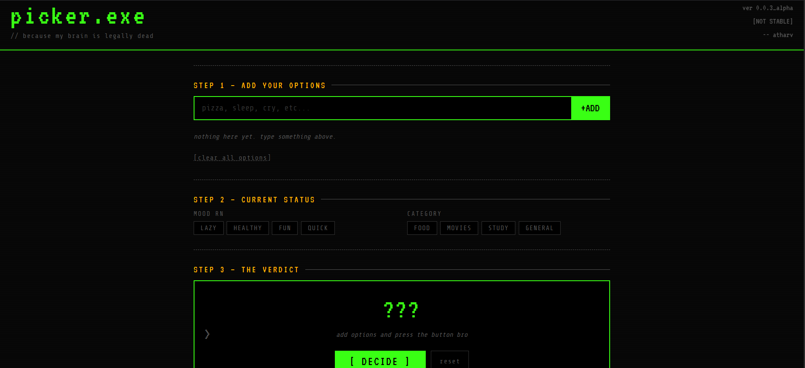

# Picker.EXE

i cant make decisions. built a thing that does it for me.

there's also a spin wheel because i wanted to learn canvas api and this was a good excuse

---

## screenshots




---

## what it does

- you add options (pizza, sleep, study, whatever)
- pick your mood and category
- it picks for you. not just random, it actually does different logic depending on mood
- spin wheel if u want
- saves last 5 decisions in localstorage

thats it

---

## run it

download the 3 files. open index.html. done.

style.css and script.js need to be in the same folder or it breaks (learned this the hard way)

```
decision-maker/
├── index.html
├── style.css
├── script.js
├── README.md
└── assets/
    ├── screenshot1.png
    └── screenshot2.png
```

no npm. no install. nothing.

---

## tech

html css vanilla js. thats all.

also used canvas api for the wheel and localstorage for history. google fonts for VT323 and Share Tech Mono (the whole vibe depends on these two).

no libraries. no frameworks. judges can read every line.

---

## how the smart picking works

```
lazy    → shuffle, pick first
healthy → sort a-z, pick first
fun     → shuffle, pick last
quick   → sort by length, pick shortest
nothing selected → pure random
```

then it matches mood + category (like lazy_food or fun_study) to a hardcoded reason list and shows why it picked that.

not machine learning. just if statements that sound smart.

---

## stuff i want to add later

- sound when wheel spins
- confetti
- more moods (exam season, gigachad, etc)
- mobile layout (currently broken on small screens, whatever)

---

## ai declaration

used claude to debug specific issues. wrote the code myself.

---

## about

Atharv Chaubey — class 11, Delhi, [@krisharv](https://github.com/krisharv)

doing JEE prep and web dev at the same time. not recommended but here we are.

learned canvas api, requestAnimationFrame, localstorage and css animations making this.

---

*// if ur reading this hi*