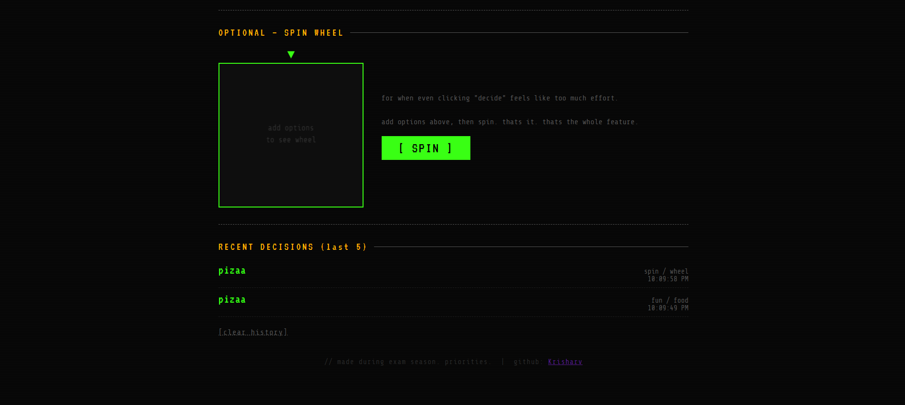

# DECISION_MAKER.EXE 🖥️

> because my brain stopped working in class 10 and never came back


---

## what is this

ok so basically i cant make decisions. like ever. "what do you want to eat" bro i dont know thats why im asking you. so i built a tool that decides for me.

its a **smart decision maker app** that takes your options, your mood, your vibe, and actually thinks about what to pick. not just random. *smart* random. there's a difference trust me.

also there's a spin wheel because spin wheel = dopamine.

---

## screenshots




> *the ui is dark, terminal-style, very "guy who watches too many matrix clips"*
> *you'll see when you open it*

---

## features

- **add options** — type anything. pizza, sleep, cry, study. whatever your life situation requires
- **smart decision engine** — picks based on your mood (lazy / healthy / fun / quick) AND category (food / movies / study / general). its not just `Math.random()` ok. well. mostly not.
- **spin wheel** — full canvas spin wheel with friction physics (i learned what requestAnimationFrame is specifically for this)
- **"why this choice?"** — gives a reason for the pick. the reasons are hardcoded but they're funny so it's fine
- **decision history** — stores last 5 decisions in localStorage so you can regret them later
- **retro terminal UI** — VT323 font, neon green on black, scanlines, flicker animation. zero rounded corners. zero AI template energy.

---

## how to run

no npm. no node. no webpack. no vite. no nothing.
```bash
# step 1
download all three files into the SAME folder

# step 2
double click index.html

# step 3
it opens in browser

# make sure style.css and script.js are sitting right next to index.html
# or it will look broken and have zero js functionality
# ask me how i know (i know)

# thats literally it. no terminal. no install. no step 4.
```

folder structure:
decision-maker/
├── index.html
├── style.css
├── script.js
├── README.md
└── assets/
   └── screenshot1.png
   └── screenshot2.png

works in chrome, firefox, probably edge (never tested edge, not going to).

---

## tech stack

| thing | why |
|-------|-----|
| HTML | structure and stuff |
| CSS | made it look like a 1990s terminal (on purpose) |
| Vanilla JS | no frameworks. judges can see every line i wrote. |
| Canvas API | for the spin wheel. took forever. worth it. |
| localStorage | history feature. free database basically |
| Google Fonts (VT323 + Share Tech Mono) | the whole vibe depends on these two fonts |

> **no libraries. no frameworks. no copy pasted templates.**
> every line written by hand. some lines written at 2am. quality may vary.

---

## how the "smart" part works

ok so the decision engine isnt actually AI or anything fancy. its more like:

```
LAZY mood   → shuffle array, pick first  (random = lazy behavior)
HEALTHY mood → sort alphabetically, pick first (a = best? dont question it)
FUN mood    → shuffle, pick LAST  (chaos)
QUICK mood  → sort by string length, pick shortest  (less letters = faster)
no mood     → pure random
```

then it looks up a `mood_category` combo (like `lazy_food` or `fun_study`) and gives you a reason from a hardcoded list.

is this machine learning? no.
does it feel smart? kind of.
does it work? yes.
shipping it? absolutely.

---

## future plans (aka the TODO list i will probably never finish)

- [ ] sound effects when wheel spins (this would go crazy)
- [ ] confetti on decision reveal
- [ ] "regret" button that undoes last decision
- [ ] more moods — Sad, Angry, Gigachad, Exam Season
- [ ] import/export options as JSON
- [ ] dark/light toggle (currently only dark. light mode users ur on ur own)
- [ ] actual mobile layout (currently "works on my machine" energy)
- [ ] maybe add AI API for real smart picks someday (jee prep first though)

---

## ai declaration

i used AI (Claude) **only for debugging** — like when my wheel was spinning backwards and i had no idea why, or when localStorage was throwing errors.

every line of code in this project was written by me, manually, by hand, on a keyboard, with my fingers. the logic, the design decisions — all me.

AI did not write this. AI did not design this. AI helped me figure out why my code was broken, same way you'd ask a senior dev "bro why is this not working."

## about / credits

**built by:** Atharv Chaubey ([@krisharv](https://github.com/krisharv))

**who am i:** class 11 student at SOSE Yamuna Vihar, Delhi. preparing for JEE while somehow also doing web dev. questionable time management. no regrets.

**why hackclub:** because building things at 2am with zero sleep is the most fun i've had this year and i want to keep doing it with people who get that.

**time spent:** honestly lost count. multiple late nights. at least one moment of "why is the wheel spinning backwards."

**learned:** canvas API, requestAnimationFrame, localStorage, CSS animations, how to make things look intentionally bad (harder than it sounds)

---

## license

do whatever you want with it. its a decision maker. let it decide.

---

*// made during exam season. priorities.*
*// if ur reading this hi 👋*